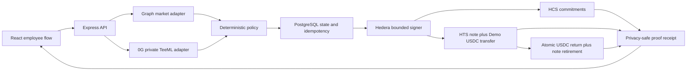
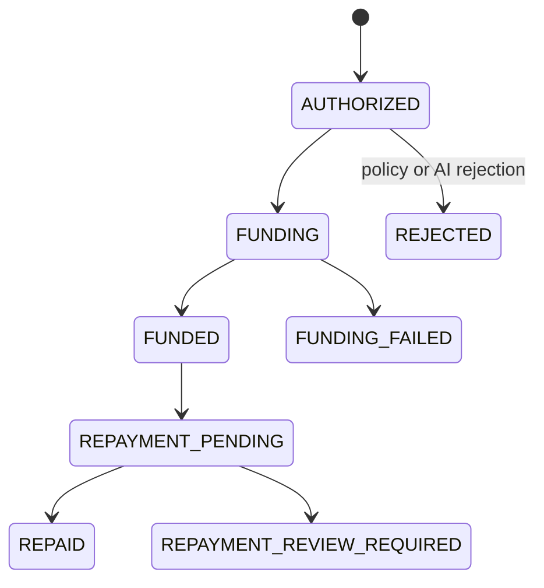

# Architecture

## Separation of duties

| Layer | Authority |
|---|---|
| Graph adapter | Reads public market evidence only |
| 0G adapter | Recommends risk band, amount, and reason codes |
| Policy | Calculates exact caps and rejects unhealthy evidence |
| Store | Enforces issuance and repayment idempotency and expiry |
| Hedera adapter | Executes bounded issuance and full-principal repayment |
| UI | Collects synthetic inputs, confirms, and presents proof |

The model cannot create a transaction, choose an arbitrary recipient, bypass
the policy cap, or access a signing key.

## Stored data

`advances.record` contains the public-safe evidence model plus a server-only
confirmation-token HMAC. No raw request or prompt is stored. Salt material is
not published, so public commitments cannot be dictionary-tested without a
backend compromise.

## State machine

The PostgreSQL implementation uses `SELECT … FOR UPDATE` to acquire the funding
transition. A repeated request observes `FUNDING` or `FUNDED` and cannot create a
second payment. `FUNDING_FAILED` is deliberately terminal because a timeout can
be ambiguous; an operator must reconcile Hedera before authorizing a new
request/nonce.

Repayment uses a distinct caller-supplied repayment ID. A repeated ID observes
the existing pending or completed record. Any repayment-stage exception becomes
`REPAYMENT_REVIEW_REQUIRED`, because a submitted HTS settlement may have reached
consensus even when the client did not receive its record.

## Failure semantics

- Validation and policy failures return 422.
- Expired or invalid state returns 409.
- Partner execution failures return 502 and move the record to
  `FUNDING_FAILED`.
- Repayment execution failures return 502 and move the record to
  `REPAYMENT_REVIEW_REQUIRED`.
- A live readiness check returns 503 when any dependency is unavailable.
- Live adapters do not silently downgrade to demo behavior.
